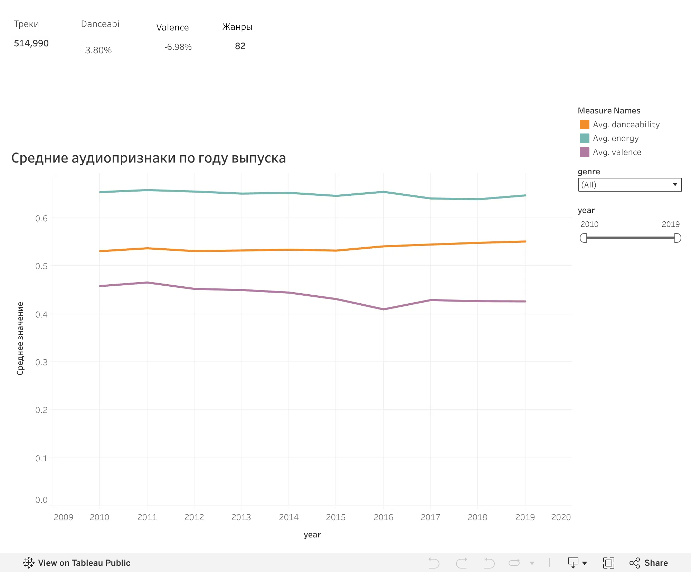

# Spotify Audio Trends, 2010–2019

Портфолио-проект на Python и Tableau о том, как в датасете Spotify менялись `valence`, `energy` и `danceability` треков 2010–2019 годов выпуска.

## Live Tableau Dashboard

[](https://public.tableau.com/views/SpotifyAudioTrends20102019/Dashboard1?:language=en-US&:sid=&:redirect=auth&:display_count=n&:origin=viz_share_link)

**[Открыть интерактивный дашборд в Tableau Public](https://public.tableau.com/views/SpotifyAudioTrends20102019/Dashboard1?:language=en-US&:sid=&:redirect=auth&:display_count=n&:origin=viz_share_link)**

GitHub README показывает статичное превью. Фильтры по жанру и году доступны по ссылке на Tableau Public.

## Главный результат

Средний `valence` снизился с **0,4587 в 2010 году до 0,4267 в 2019-м**: на **0,0320 пункта**, или **7,0%** относительно уровня 2010 года. 95%-й интервал для разницы составляет **от −0,0353 до −0,0287**.

Это умеренный сдвиг агрегированного показателя, а не доказательство того, что «музыка стала грустнее». Год выпуска объясняет только **0,27% вариации `valence` отдельных треков** (`R² = 0,0027`). `Valence` описывает воспринимаемую позитивность звучания, но не смысл текста или настроение слушателей.

Дополнительные результаты:

- средний `danceability` вырос с **0,5315 до 0,5517** — на **3,8%**;
- средний `energy` изменился с **0,6547 до 0,6478** — на **−1,1%**;
- снижение `valence` сохраняется в проверке с одинаковым весом 49 жанров, представленных во всех десяти годах: **−0,0451**;
- динамика неоднородна по жанрам, поэтому общий тренд нельзя автоматически переносить на каждый жанр.

## Данные и методика

Источник — публичный набор [Spotify 1 Million Tracks на Kaggle](https://www.kaggle.com/datasets/amitanshjoshi/spotify-1million-tracks): 1 159 764 записей, 82 жанра и годы выпуска 2000–2023. Анализ ограничен 2010–2019 годами и включает **514 990 треков**.

Ноутбук:

- валидирует схему, пропуски, дубли и диапазоны значений;
- не удаляет корректные наблюдения только потому, что они попали под IQR-правило;
- рассчитывает средние по годам, стандартные ошибки и 95%-е интервалы;
- оценивает изменения 2010 → 2019, линейные тренды и `R²`;
- проверяет чувствительность результата к изменению жанрового состава;
- сравнивает 15 наиболее представленных жанров;
- рассматривает связи с `popularity` только как описательные корреляции.

## Воспроизводимость

```bash
python3 -m pip install -r requirements.txt
jupyter nbconvert --to notebook --execute data/analysis.ipynb \
  --output analysis.executed.ipynb --output-dir data
```

При первом запуске ноутбук автоматически скачивает исходный CSV из публичного Kaggle API в `data/raw/`. Можно использовать уже скачанный файл, передав путь через `SPOTIFY_DATA_PATH`. Исходный CSV и выполненная копия ноутбука не добавляются в Git.

`data/processed/` содержит только компактные итоговые таблицы, из которых легко проверить цифры README или построить собственные визуализации:

- `yearly_trends.csv` — годовые средние и интервалы;
- `endpoint_changes.csv` — изменения 2010 → 2019 и параметры тренда;
- `genre_summary.csv` и `genre_year_trends.csv` — жанровые сводки;
- `genre_mix_sensitivity.csv` — проверка с одинаковыми весами жанров;
- `genre_valence_changes_top15.csv` — динамика для топ-15 жанров;
- `data_quality_summary.csv` — результаты проверок качества.

Большие исходные и построчные экспортные CSV намеренно исключены: они воспроизводятся ноутбуком и не нужны для просмотра проекта.

## Структура

```text
.
├── README.md
├── requirements.txt
├── data/
│   ├── analysis.ipynb
│   └── processed/          # компактные воспроизводимые сводки
├── images/
│   └── tableau_dashboard.png
└── scripts/
    └── build_notebook.py   # служебная генерация исходного ноутбука
```

## Ограничения

- Это удобная выборка треков, а не случайная выборка всей выпущенной музыки или всех прослушиваний Spotify.
- `year` — год выпуска трека, а не год прослушивания.
- `popularity` — изменяющийся показатель снимка данных; его нельзя считать популярностью на момент релиза.
- Точность жанровых меток и аудиопризнаков отдельно не проверялась.
- Узкие интервалы отражают большой объём данных, но не устраняют неопределённость способа формирования датасета и зависимость треков одного исполнителя.
